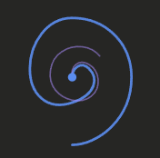
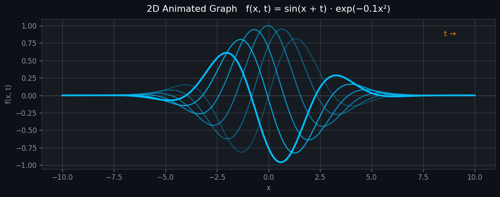
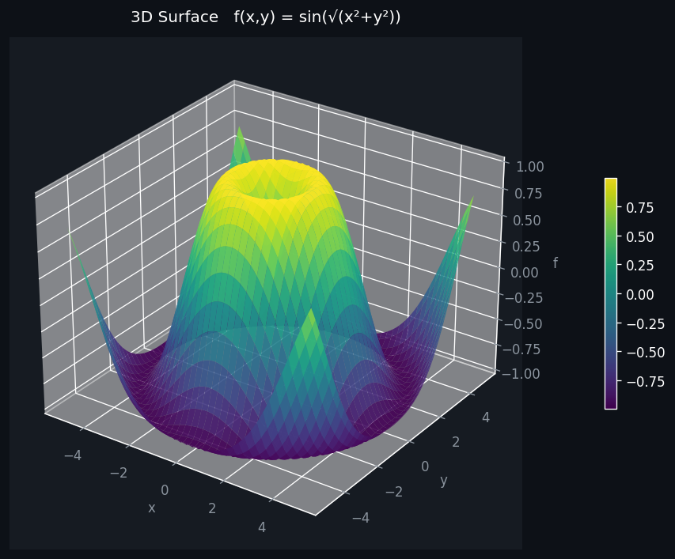
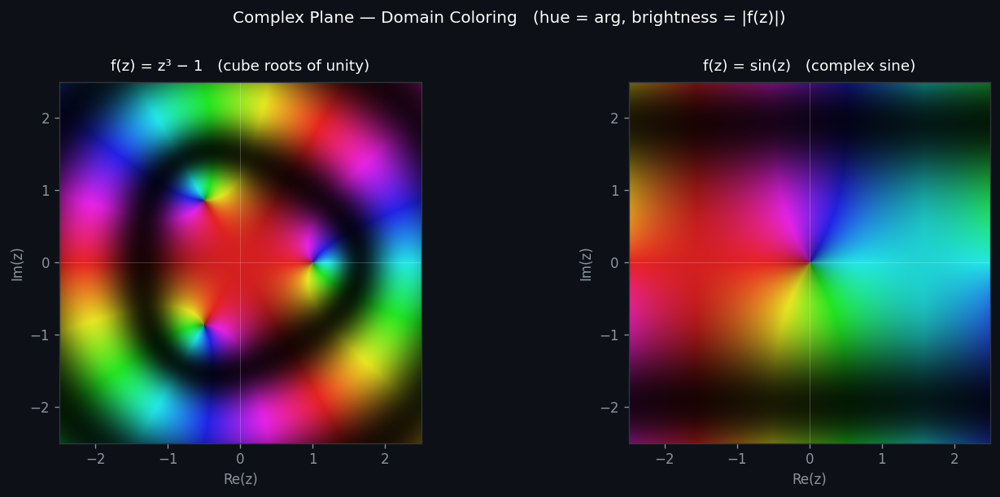
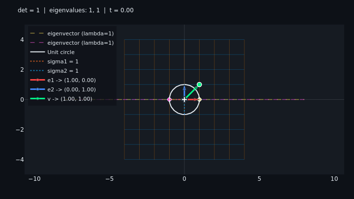
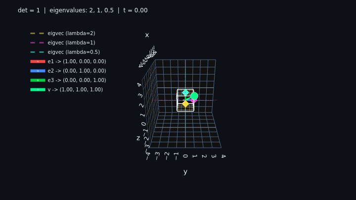
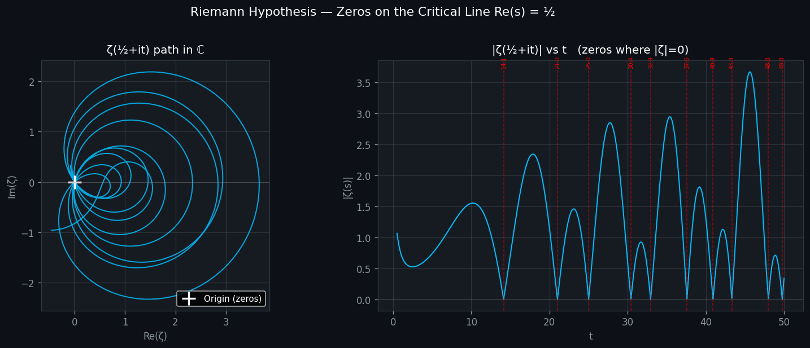

<p align="center">
  
</p>

<h1 align="center">Manifold</h1>

<p align="center">
  <em>Own the space</em>
</p>

<p align="center">
  <a href="https://www.python.org/downloads/"></a>
  <a href="LICENSE"></a>
</p>

<p align="center">
  A mathematical animation toolkit for visualizing complex functions, 2D/3D graphs, and Riemann Hypothesis structures. Built for interactive Jupyter notebooks and a live web app.
</p>

<br>

**Key features:**
- Safe equation input via AST-whitelisted parser (no eval vulnerabilities)
- Domain coloring for complex function visualization
- Riemann zeta function explorations (zeros, critical strip, winding numbers)
- Linear transformation visualizer with grid morphing, eigenvector lines, SVD ellipse axes, and trace paths
- GPU accelerated zeta computation via CuPy with automatic CPU fallback
- Interactive web app with real-time animation
- Extensible animation framework with auto-discovery

<br>

## Quick Start

```bash
# Clone the repo
git clone https://github.com/yourusername/Manifold.git
cd Manifold

# Install with all extras
pip install -e ".[notebook,webapp,dev]"

# Run the web app
python -m webapp.app
# Open http://localhost:8050

# Or launch Jupyter notebooks
jupyter lab
```

<br>

## Web App

The interactive web app lets you explore all visualizations with real-time controls:

- **Equation presets** -- click to load common equations instantly
- **Live animation** -- Play/Pause with adjustable speed
- **8 visualization modes**: 2D graphs, 3D surfaces, complex plane, linear transformations, and 4 Riemann zeta views
- **GPU acceleration** via CuPy with automatic CPU fallback
- **Resolution control** -- trade compute time for sharpness

```bash
python -m webapp.app
```

<br>

## Animations

<br>

### 2D Graph f(x, t)

Animate any equation where `x` is the spatial axis and `t` advances each frame.

<p align="center">
  
</p>

<p align="center">
  
</p>

#### How it works

| Term | What it controls | Example |
|------|-----------------|---------|
| `A * sin(...)` | Amplitude, controls peak height | `2 * sin(x)` doubles height |
| `sin(k*x)` | Spatial frequency, peaks per unit | `sin(3*x)` is 3x denser |
| `sin(x - v*t)` | Wave travelling right at speed v | `sin(x - 2*t)` |
| `sin(x + v*t)` | Wave travelling left at speed v | `sin(x + t)` |
| `sin(x) * cos(t)` | Standing wave, nodes stay fixed | nodes at multiples of pi |
| `* exp(-a*x**2)` | Gaussian envelope, localises the wave | `sin(x+t) * exp(-0.1*x**2)` |
| `f(x) + g(x)` | Superposition, interference and beats | `sin(x+t) + sin(x+1.05*t)` |

#### Equations to try

```
sin(x + t)
sin(x) * cos(t)
sin(x + t) * exp(-0.1 * x**2)
cos(3*x - 2*t) + 0.5 * sin(5*x + t)
sin(x * t) / (1 + x**2)
exp(-0.05*(x - 3*t)**2)
sin(x + t) + sin(x + 1.05*t)
tanh(x - 2*t)
```

<br>

### 3D Surface f(x, y)

Rotating 3D surface plots. Drag to orbit, scroll to zoom, use the Play button for a continuous 360 degree rotation. Color encodes height via the colorbar.

<p align="center">
  
</p>

<p align="center">
  
</p>

#### Equations to try

```
sin(sqrt(x**2 + y**2))
exp(-0.1*(x**2 + y**2)) * cos(x + y)
sin(x) * cos(y)
x * exp(-x**2 - y**2)
(1 - 2*(x**2+y**2)) * exp(-(x**2+y**2))
sin(x**2 + y**2) / (x**2 + y**2 + 1)
```

<br>

### Complex Plane f(z)

Domain coloring maps every point in the complex plane to a color. Phase (hue) and magnitude (brightness rings) are encoded simultaneously, making zeros, poles, and winding numbers instantly visible.

<p align="center">
  
</p>

<p align="center">
  
</p>

#### How to read the colors

| Visual feature | What it encodes | Formula |
|---------------|----------------|---------|
| Hue (color wheel) | Phase / argument of output | `arg(f(z))` in [-pi, pi] |
| Brightness rings | Magnitude on a log scale, each ring is x e | `log(1 + \|f(z)\|)` |
| Dark pinch points | Zeros where f(z) = 0 | All colors converge inward |
| Bright chaos | Poles where \|f(z)\| -> infinity | Colors cycle rapidly outward |

#### Equations to try (variable `z`)

```
z**2
z**3 - 1
(z**2 - 1) / (z**2 + 1)
sin(z)
exp(z)
1 / z
(z - 1j) / (z + 1j)
```

#### Animated (include `t`, use Play button)

```
z**2 + t * 0.3
sin(z + t)
z**3 + t * z
```

<br>

### Linear Transformation

Visualize how matrices transform space. Enter any 2x2 or 3x3 matrix and watch the entire coordinate grid smoothly morph from identity to the target transformation. Inspired by 3Blue1Brown's "Essence of Linear Algebra" series.

<p align="center">
  
</p>

<p align="center">
  
</p>

#### Features

| Feature | What it shows |
|---------|--------------|
| Grid morphing | Space bends smoothly from identity to the matrix as t animates |
| Unit circle to ellipse | The circle stretches into an ellipse whose axes are the singular vectors (SVD) |
| Eigenvector lines | When real eigenvalues exist, dashed lines mark directions that only scale, never rotate |
| Trace paths | A fading trail behind the vector tip shows the arc it sweeps through |
| Basis vectors | Red (e1) and blue (e2) arrows show where the standard basis lands |
| Determinant and eigenvalues | Displayed in the title, updating live |

#### How it works

The animation interpolates `M(t) = (1 - t) * I + t * A` where `I` is the identity and `A` is your matrix. As `t` goes from 0 to 1, every point in space moves along a straight path from its original position to its transformed position. This is the same linear interpolation that makes the 3Blue1Brown animations so intuitive.

Eigenvectors of `A` are special: since `M(t) * v = (1 - t + t * lambda) * v`, vectors along eigenvector directions stay on their line at every step. They only scale, never rotate. The dashed eigenvector lines let you verify this visually.

#### Matrices to try (rows separated by semicolons)

| Name | Matrix | What you see |
|------|--------|-------------|
| Rotation 45 | `0.707, -0.707; 0.707, 0.707` | Pure rotation, no stretching, det = 1 |
| Shear | `1, 1; 0, 1` | Horizontal shear, top slides right, eigenvectors both vertical |
| Anisotropic scale | `2, 0; 0, 0.5` | Stretch x by 2, compress y by half, det = 1 |
| Reflection | `1, 0; 0, -1` | Mirror across x axis, det = -1 (orientation flips) |
| Rotation 90 | `0, -1; 1, 0` | Quarter turn, complex eigenvalues (no eigenvector lines) |
| Singular | `1, 2; 0.5, 1` | det = 0, space collapses to a line |

#### 3D matrices to try

```
2, 0, 0; 0, 2, 0; 0, 0, 2          Scale uniformly
0.707, -0.707, 0; 0.707, 0.707, 0; 0, 0, 1   Rotate around Z axis
1, 1, 0; 0, 1, 0; 0, 0, 1          Shear in XY
1, 0, 0; 0, 1, 0; 0, 0, -1         Reflect across Z = 0
```

You can also enter an optional vector (e.g. `1, 2`) to see how a specific vector gets carried along by the transformation. The green arrow and its fading trail show the path.

<br>

### Riemann Hypothesis

> *"The nontrivial zeros of zeta(s) have real part equal to 1/2."* -- Bernhard Riemann, 1859

The **Riemann zeta function** is defined for `Re(s) > 1` as:

```
zeta(s) = 1 + 1/2^s + 1/3^s + 1/4^s + ...
```

It is extended to the entire complex plane via analytic continuation. Its zeros encode the distribution of prime numbers, and the **Riemann Hypothesis** has been open since 1859 (Millennium Prize: $1 million).

<br>

#### Zeros on the Critical Line

Traces the path of `zeta(1/2 + it)` in the complex plane as `t` grows. Every time the orange dot crosses the origin, a nontrivial zero occurs.

<p align="center">
  
</p>

<p align="center">
  
</p>

#### Critical Strip Heatmap

Shows `log(1+|zeta(s)|)` and `arg(zeta(s))` as heatmaps over `0 < Re(s) < 1`. Zeros appear as dark spots (magnitude) and phase vortices (argument).

<p align="center">
  
</p>

#### Winding Number (Argument Principle)

The number of zeros inside a closed contour equals the winding number of the image around the origin. Watch the count increment as you raise the contour.

<br>

## Project Structure

```
manifold/
  core/          BaseAnimator, AnimationRegistry, EquationParser (AST safe eval)
  math/          zeta.py, zeta_fast.py (Euler-Maclaurin), gpu_backend.py (CuPy/NumPy),
                 complex_ops.py (domain coloring), numerics.py
  animations/    graph2d, graph3d, complex_plane
    riemann/     zeros, critical_strip, zeta_surface, winding_number, continuation
  jupyter/       EquationWidget, AnimationWidget
  config.py      Style constants, cache settings

notebooks/       4 interactive Jupyter notebooks
webapp/          Dash + Plotly web app (includes linear transformation visualizer)
tests/           pytest suite
```

<br>

## Extending

Adding a new animation is one file:

```python
# manifold/animations/my_animation.py
from manifold.core.animator import BaseAnimator, AnimationConfig
from manifold.core.registry import AnimationRegistry

@AnimationRegistry.register
class MyAnimator(BaseAnimator):
    NAME = "my_animation"
    DESCRIPTION = "What it does"

    def setup(self) -> None:
        self.fig, ax = ...

    def update(self, frame: int) -> list:
        return [self._line]
```

It will be auto-discovered with no other changes needed.

<br>

## Tech Stack

| Library | Purpose |
|---------|---------|
| matplotlib | Jupyter notebook animations |
| plotly + dash | Interactive web app |
| numpy | Numerical arrays, vectorized zeta computation (Euler-Maclaurin) |
| scipy | Root finding, special functions |
| cupy (optional) | GPU acceleration for zeta and array operations |
| ipywidgets | Jupyter equation input widgets |

<br>

## Development

```bash
# Install dev dependencies
pip install -e ".[dev]"

# Run tests
pytest

# Lint
ruff check .

# Type check
mypy manifold/
```

<br>

## Contributing

Contributions are welcome! Here's how to get started:

1. Fork the repository
2. Create a feature branch (`git checkout -b feature/my-feature`)
3. Make your changes and add tests
4. Run `pytest` and `ruff check .` to verify
5. Commit and push to your fork
6. Open a Pull Request

**Areas where contributions are especially welcome:**
- New animation types (add to `Manifold/animations/`)
- Performance optimizations for zeta computations
- Additional notebook examples
- UI/UX improvements to the web app
- Documentation improvements

<br>

## License

[MIT](LICENSE)
