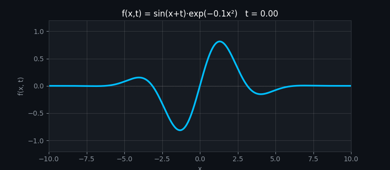
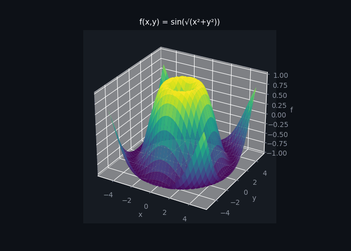
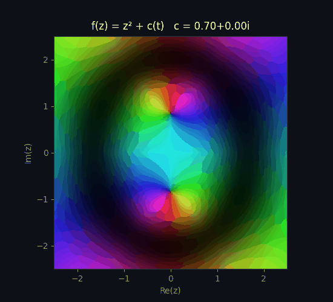
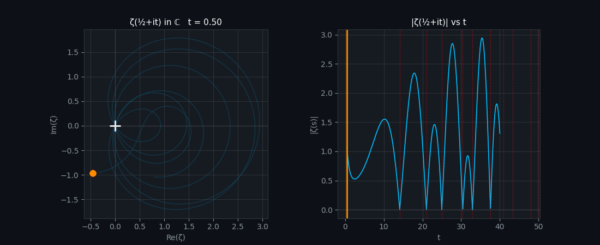
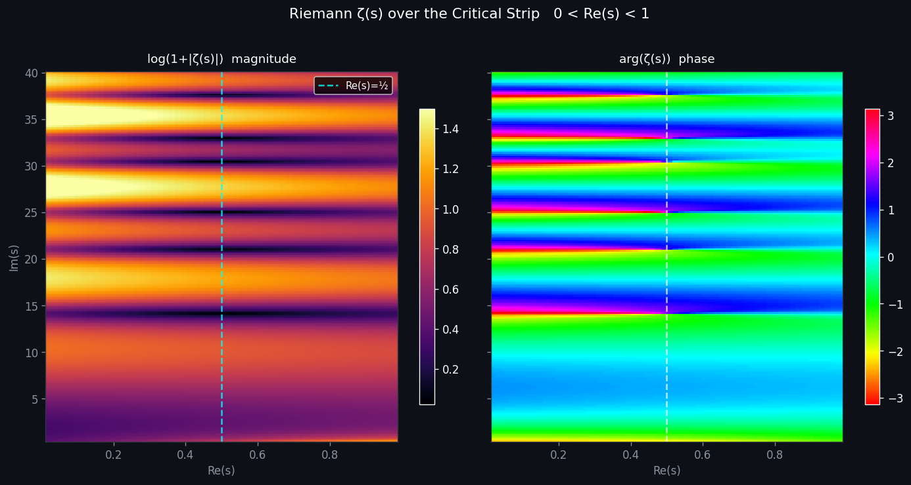

# mathplt

A mathematical animation toolkit for visualizing complex functions, 2D/3D graphs, and Riemann Hypothesis structures — built for Jupyter notebooks and an interactive web app.

---

## Setup

```bash
pip install -e ".[notebook,webapp]"
```

Run the web app:

```bash
python -m webapp.app
```

Open **http://localhost:8050** in your browser.

Run Jupyter notebooks:

```bash
jupyter lab
```

---

## Animations

### 2D Graph   f(x, t)

Animate any equation where `x` is the spatial axis and `t` advances each frame.



**Example equations**

```
sin(x + t)
sin(x + t) * exp(-0.1 * x**2)
cos(3*x - 2*t) + 0.5 * sin(5*x + t)
sin(x * t) / (1 + x**2)
```

---

### 3D Surface   f(x, y)

Rotating 3D surface plots with full mouse drag rotation in the web app.



**Example equations**

```
sin(sqrt(x**2 + y**2))
exp(-0.1*(x**2 + y**2)) * cos(x + y)
sin(x) * cos(y)
x * exp(-x**2 - y**2)
```

---

### Complex Plane   f(z)

Domain coloring maps every point in the complex plane to a color:

**Hue** encodes `arg(f(z))` — the angle/phase of the output  
**Brightness rings** encode `log|f(z)|` — each ring is a factor of `e`  
**Dark spots** are zeros of `f(z)`  
**Bright chaotic patches** are poles  



**Example equations** (use variable `z`)

```
z**2
z**3 - 1
z**4 - 1
(z**2 - 1) / (z**2 + 1)
sin(z)
exp(z)
log(z)
```

Animated (include `t`, use Play button):

```
z**2 + t * 0.3
sin(z + t)
z**3 + t * z
```

---

### Riemann Hypothesis

> *"The non-trivial zeros of ζ(s) have real part equal to 1/2."*  — Bernhard Riemann, 1859

The **Riemann zeta function** is defined for `Re(s) > 1` as:

```
ζ(s) = 1 + 1/2^s + 1/3^s + 1/4^s + ...
```

and extended to the entire complex plane via analytic continuation.

#### Zeros on the Critical Line

The path of `ζ(½ + it)` as `t` increases. Every time the path **crosses the origin**, there is a nontrivial zero. The Riemann Hypothesis says all nontrivial zeros satisfy `Re(s) = ½`.



Known zeros (imaginary parts): `14.135, 21.022, 25.011, 30.425, 32.935, ...`

#### Critical Strip Heatmap

Magnitude and phase of `ζ(s)` over the critical strip `0 < Re(s) < 1`.  
Zeros appear as dark spots along the cyan dashed critical line `Re(s) = ½`.



> The cyan dashed line marks the critical line Re(s) = ½. Dark spots along it are zeros of ζ(s).

#### Winding Number

The **argument principle** states:

```
N(zeros inside C) = (1/2πi) ∮ ζ'(s)/ζ(s) ds
```

As a rectangular contour expands upward in the s-plane, the image `ζ(C)` in the w-plane winds around the origin once per enclosed zero. You can watch the winding count increment live.

#### Analytic Continuation

Shows how the Dirichlet series `Σ n^{-s}` (valid only for `Re(s) > 1`) compares with the full analytic continuation of `ζ(s)` across the entire complex plane.

---

## Project Structure

```
mathplt/
  core/          BaseAnimator, AnimationRegistry, EquationParser (AST safe)
  math/          zeta.py (mpmath), complex_ops.py (domain coloring), numerics.py
  animations/    graph2d, graph3d, complex_plane
    riemann/     zeros, critical_strip, zeta_surface, winding_number, continuation
  jupyter/       EquationWidget, AnimationWidget

notebooks/
  01_graph2d.ipynb
  02_graph3d.ipynb
  03_complex_plane.ipynb
  04_riemann.ipynb

webapp/
  app.py         Dash + Plotly web app (rotate, zoom, pan, animate)

assets/
  graph2d.png
  graph3d.png
  complex_plane.png
  riemann_zeros.png
  critical_strip.png
```

---

## Extending

Adding a new animation is one file:

```python
# mathplt/animations/my_animation.py
from mathplt.core.animator import BaseAnimator, AnimationConfig
from mathplt.core.registry import AnimationRegistry

@AnimationRegistry.register
class MyAnimator(BaseAnimator):
    NAME = "my_animation"
    DESCRIPTION = "What it does"

    def setup(self) -> None:
        self.fig, ax = ...

    def update(self, frame: int) -> list:
        return [self._line]
```

It will be auto-discovered with no other changes needed.

---

## Tech Stack

| Library | Purpose |
|---------|---------|
| matplotlib | Jupyter notebook animations |
| plotly + dash | Interactive web app |
| mpmath | High precision complex math (zeta function) |
| numpy | Numerical arrays |
| ipywidgets | Jupyter equation input widgets |
